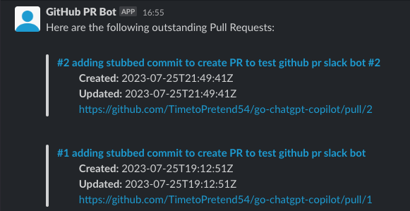

# GitHub PR Slack Bot



Repository for creating GitHub PR Slack Bot for running scheduled job to compile list of outstanding PR requests.

Utilizes GitHub Actions to run the Cron Job Once a day at 4:05pm UTC.

## Slack Configuration
1. Create/Determine Slack Workspace to use
2. Create Slack App (https://api.slack.com/apps -> Create New App -> From Scratch)
3. Navigate to Slack https://api.slack.com/apps/{YOUR_APP_ID}
4. Under `OAuth & Permissions` add:
    - `channels:read`
    - `chat:write`
    - `groups:read`
    - `im:read`
    - `mpim:read`
5. Navigate to Top of Section and Select "Install/Reinstall to Workspace"
6. Add `Bot User OAuth Token` to Deployment ENV Variables (see below for more info)
7. Add {SLACK_APP_NAME} to desired channels
   1. https://app.slack.com -> desired workspace where SLACK_APP_NAME is
   2. Find SLACK_APP_NAME under `Apps` section
   3. Right click -> `View app details` -> `add this app to a channel`
      1. Add to all desired channels (app will not work in channel without it)
8. Follow Guide(s) Below for Desired Deployment Option

## Deploying Slack Bot Application

Required Python Dependencies 
- ex: for PythonAnywhere -> Dashboard -> New Console -> Bash
- ex: for GitHub Actions, add to job steps (see [actions.yml](actions.yml), [requirements.txt](requirements.txt))
```
pip install slack_sdk
pip install requests
```

### 1. GitHub Actions

**Chosen for my deployment.** See [this guide](https://www.python-engineer.com/posts/run-python-github-actions/) for more details.

- https://www.python-engineer.com/posts/run-python-github-actions/
- https://github.com/patrickloeber/python-github-action-template
  - https://docs.github.com/en/actions/learn-github-actions/understanding-github-actions#workflows
- requirements.txt (python module mgmt): 
  - https://docs.dominodatalab.com/en/4.6/user_guide/9c4f82/use-requirements-txt--python-only-/
  - https://www.jetbrains.com/help/idea/managing-dependencies.html#configure-requirements

#### Issue w/ CRON Accuracy
NOT stable, refer to links below for more info, might not run cron or if it does 5-15 minutes later than scheduled
- https://github.com/orgs/community/discussions/52477#discussioncomment-5580518
- https://docs.github.com/en/actions/using-workflows/events-that-trigger-workflows#schedule

### 2. PythonAnywhere

Navigate to https://www.pythonanywhere.com/login/ to view.

- https://machinelearningprojects.net/deploy-a-flask-app-online/
- https://help.pythonanywhere.com/pages/UploadingAndDownloadingFiles/
- [Running bash script in task scheduler](https://www.pythonanywhere.com/forums/topic/12398/)
- Adding ENV Variables for Scheduled Tasks (See [option 1](https://www.pythonanywhere.com/forums/topic/1113/) & [option 2](https://www.pythonanywhere.com/forums/topic/8892/))
- https://help.pythonanywhere.com/pages/ScheduledTasks/

### 3. AWS EC2 Instance
- https://blog.devgenius.io/how-to-run-python-program-within-aws-ec2-instance-38b1d71e9374
- https://saturncloud.io/blog/how-to-set-an-environment-variable-in-amazon-ec2/
- https://stackoverflow.com/questions/30806318/how-to-cron-job-setup-in-amazon-ec2
  - https://www.cyberciti.biz/faq/how-do-i-add-jobs-to-cron-under-linux-or-unix-oses/

## References/Guides
- https://python.plainenglish.io/lets-create-a-slackbot-cause-why-not-2972474bf5c1
- https://slack.dev/python-slack-sdk/
- https://stateful.com/blog/github-pulls-api-manage-prs
    - https://www.section.io/engineering-education/working-with-github-web-api-in-python/
    - https://melaniesoek0120.medium.com/how-to-use-github-api-to-extract-data-with-python-bdc61106a501
    - [Accessing Another Repository in GitHub Actions](https://stackoverflow.com/a/71070149)
    - For Private Repos: Create a machine user account on GitHub 
      - Requires organization -> add machine user as external collaborator -> set read-only access (for classic Personal Access Tokens, Fine-Grain allows more control)
      - https://cloud.redhat.com/blog/private-git-repositories-part-3-personal-access-tokens
      - https://docs.github.com/en/authentication/connecting-to-github-with-ssh/managing-deploy-keys#machine-users
      - https://docs.github.com/en/actions/security-guides/automatic-token-authentication#permissions-for-the-github_token

### GitHub API - Personal Access Tokens
- https://docs.github.com/en/authentication/keeping-your-account-and-data-secure/managing-your-personal-access-tokens#fine-grained-personal-access-tokens
- https://docs.github.com/en/authentication/keeping-your-account-and-data-secure/managing-your-personal-access-tokens#keeping-your-personal-access-tokens-secure
- [List Repos of a User/Org](https://stackoverflow.com/a/33159888)
  - https://docs.github.com/en/free-pro-team@latest/rest/repos/repos?apiVersion=2022-11-28#list-organization-repositories

### GitHub Recommends creating a GitHub App to Authenticate w/ GitHub API for an Organization
- https://docs.github.com/en/rest/guides/getting-started-with-the-rest-api?apiVersion=2022-11-28#about-tokens
